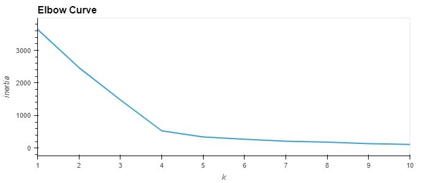
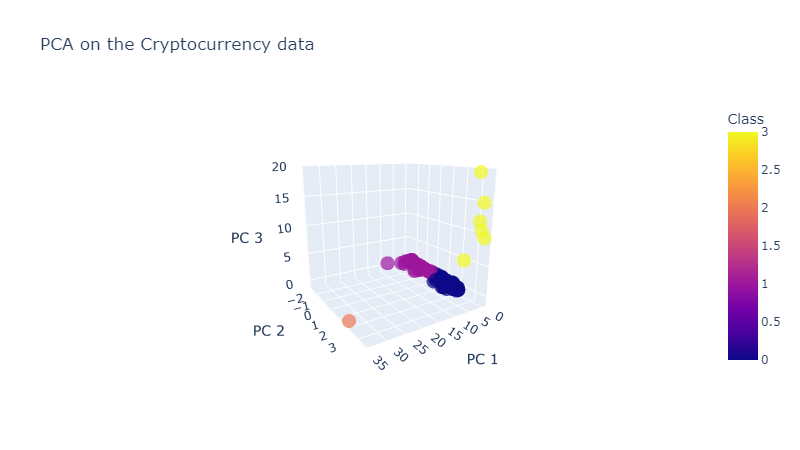
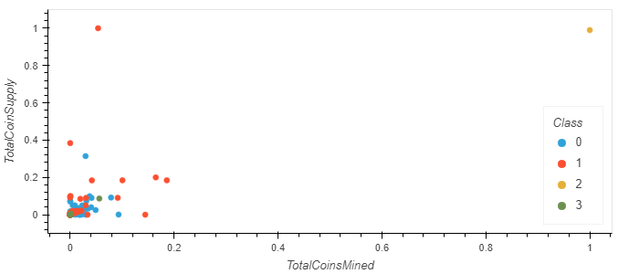

<a name="readme-top"></a>

<!-- PROJECT SHIELDS -->
<!--
*** I'm using markdown "reference style" links for readability.
*** Reference links are enclosed in brackets [ ] instead of parentheses ( ).
*** See the bottom of this document for the declaration of the reference variables
*** for contributors-url, forks-url, etc. This is an optional, concise syntax you may use.
*** https://www.markdownguide.org/basic-syntax/#reference-style-links
-->
[![Contributors][contributors-shield]][contributors-url]
[![Forks][forks-shield]][forks-url]
[![Stargazers][stars-shield]][stars-url]
[![Issues][issues-shield]][issues-url]
[![MIT License][license-shield]][license-url]

<!-- PROJECT LOGO -->
<br />
<div align="center">  
<h3 align="center">Cryptocurrencies</h3>

  <p align="center">
    Unsupervised machine learning to group tradeable cryptocurrencies. 
    <br />
    <br />
    <a href="https://nbviewer.org/github/matin-n/Cryptocurrencies/blob/main/crypto_clustering.ipynb">View Notebook</a>
    ·
    <a href="https://github.com/matin-n/Cryptocurrencies/issues">Report Bug</a>
    ·
    <a href="https://github.com/matin-n/Cryptocurrencies/issues">Request Feature</a>
  </p>
</div>


<!-- TABLE OF CONTENTS -->
<details>
  <summary>Table of Contents</summary>
  <ol>
    <li>
      <a href="#about-the-project">About The Project</a>
      <ul>
        <li><a href="#built-with">Built With</a></li>
      </ul>
    </li>
    <li>
      <a href="#getting-started">Getting Started</a>
      <ul>
        <li><a href="#prerequisites">Prerequisites</a></li>
        <li><a href="#installation">Installation</a></li>
      </ul>
    </li>
    <li>
      <a href="#visualizations">Visualizations</a>
      <ul>
        <li><a href="#elbow-curve">Elbow Curve</a></li>
        <li><a href="#pca-k-means-clustering">PCA K-Means Clustering</a></li>
        <li><a href="#scatter-chart-totalcoinsmined-x-totalcoinsupply">Scatter Chart (TotalCoinsMined x TotalCoinSupply)</a></li>
      </ul>
    </li>
    <li><a href="#visualizations">Visualizations</a></li>
    <li><a href="#roadmap">Roadmap</a></li>
    <li><a href="#contributing">Contributing</a></li>
    <li><a href="#license">License</a></li>
    <li><a href="#contact">Contact</a></li>
    <li><a href="#acknowledgments">Acknowledgments</a></li>
  </ol>
</details>


<!-- ABOUT THE PROJECT -->
## About The Project

![Project Screen Shot][project-screenshot]

A report includes the available cryptocurrencies trading on the market and how they could be grouped to create a classification system for a new investment. First, the dataset is preprocessed in order to perform principle component analysis (PCA), then the PCA algorithm is applied to reduce the dataset into three principal components. Next, the K-means algorithm is used to predict the K clusters. Finally, scatter plots are created to visualize the distinct groups corresponding to the three principal components.

The project can be summed up into the four following steps:

1. Data Preprocessing
2. Reducing Data Dimension Using PCA
3. Clustering Cryptocurrencies Using K-means
4. Visualizing Results

<p align="right">(<a href="#readme-top">back to top</a>)</p>


### Built With

* [![Python][python-logo]][python-url]
* [![Pandas][pandas-logo]][pandas-url]
* [![Plotly][plotly-logo]][plotly-url]
* [![Scikit][scikit-logo]][scikit-url]
* [![Hvplot][hvplot-logo]][hvplot-url]

<p align="right">(<a href="#readme-top">back to top</a>)</p>


<!-- GETTING STARTED -->
## Getting Started

To get a local copy up and running follow these simple example steps.

### Prerequisites

This project was developed with:
* Python 3.8.13
* Pandas 1.5.1
* Plotly 5.11.0
* Scikit-learn 1.1.3
* hvPlot 0.8.1


### Installation

1. Clone the repo
   ```sh
   git clone https://github.com/matin-n/Cryptocurrencies.git
   ```
2. Install Prerequisites
   ```sh
   # Create new environment
   mamba create -n crypto python=3.8 -c conda-forge

   # Activate environment
   mamba activate crypto

   # Install pandas, plotly, and sci-kit learn
   mamba install -c conda-forge pandas=1.5.1 plotly=5.11 scikit-learn=1.1.3

   # Install hvplot
   mamba install -c pyviz hvplot=0.8.1
   ```
3. Run Jupyter notebook
   ```sh
   jupyter notebook crypto_clustering.ipynb
   ```

<p align="right">(<a href="#readme-top">back to top</a>)</p>


<!-- VISUAL EXAMPLES -->
## Visualizations

_To see the complete source code, please refer to the [crypto_clustering.ipynb](https://nbviewer.org/github/matin-n/Cryptocurrencies/blob/main/crypto_clustering.ipynb) notebook._

### Elbow Curve

```python
# Find the best value for K
inertia = []
k = list(range(1, 11))

# Calculate the inertia for the range of K values
for num_clusters in k:
    km = KMeans(
        n_clusters=num_clusters, random_state=0
    )  # algorithm="full" | init="k-means++"
    km.fit(pcs_df)
    inertia.append(km.inertia_)

# Create the elbow curve
elbow_data = {"k": k, "inertia": inertia}
df_elbow = pd.DataFrame(elbow_data)
df_elbow.hvplot.line(x="k", y="inertia", xticks=k, title="Elbow Curve")
```


### PCA K-Means Clustering
```python
# Creating a 3D-Scatter with the PCA data and the clusters
fig = px.scatter_3d(
    clustered_df,
    title="PCA on the Cryptocurrency data",
    x="PC 1",
    y="PC 2",
    z="PC 3",
    color="Class",
    opacity=0.7,
    width=800,
    hover_name="CoinName",
    hover_data=["Algorithm", "TotalCoinSupply"],
)
fig.update_layout(legend=dict(x=0, y=1))
fig.show()
```


### Scatter Chart (TotalCoinsMined x TotalCoinSupply)
```python
# Create a hvplot.scatter plot using x="TotalCoinsMined" and y="TotalCoinSupply".
plot_df.hvplot.scatter(
    x="TotalCoinsMined",
    y="TotalCoinSupply",
    by="Class",
    legend="bottom_right",
    hover_cols="CoinName",
)
```


<p align="right">(<a href="#readme-top">back to top</a>)</p>


<!-- ROADMAP -->
## Roadmap

- [ ] Use Latest Data
- [ ] Interactive Dashboard


See the [open issues](https://github.com/matin-n/Cryptocurrencies/issues) for a full list of proposed features (and known issues).

<p align="right">(<a href="#readme-top">back to top</a>)</p>


<!-- CONTRIBUTING -->
## Contributing

Contributions are what make the open source community such an amazing place to learn, inspire, and create. Any contributions you make are **greatly appreciated**.

If you have a suggestion that would make this better, please fork the repo and create a pull request. You can also simply open an issue with the tag "enhancement".
Don't forget to give the project a star! Thanks again!

1. Fork the Project
2. Create your Feature Branch (`git checkout -b feature/AmazingFeature`)
3. Commit your Changes (`git commit -m 'Add some AmazingFeature'`)
4. Push to the Branch (`git push origin feature/AmazingFeature`)
5. Open a Pull Request

<p align="right">(<a href="#readme-top">back to top</a>)</p>


<!-- LICENSE -->
## License

Distributed under the MIT License. See `LICENSE` for more information.

<p align="right">(<a href="#readme-top">back to top</a>)</p>


<!-- CONTACT -->
## Contact

Matin - matin.github@gmail.com

Project Link: [https://github.com/matin-n/Cryptocurrencies](https://github.com/matin-n/Cryptocurrencies)

<p align="right">(<a href="#readme-top">back to top</a>)</p>


<!-- ACKNOWLEDGMENTS -->
## Acknowledgments

* Data Source: [CryptoCompare](https://min-api.cryptocompare.com/)
* Code Formatter: [Black](https://github.com/psf/black)
* Package Manager: [Mamba](https://github.com/mamba-org/mamba)


<p align="right">(<a href="#readme-top">back to top</a>)</p>


<!-- MARKDOWN LINKS & IMAGES -->
<!-- https://www.markdownguide.org/basic-syntax/#reference-style-links -->
[contributors-shield]: https://img.shields.io/github/contributors/matin-n/Cryptocurrencies.svg?style=for-the-badge
[contributors-url]: https://github.com/matin-n/Cryptocurrencies/graphs/contributors
[forks-shield]: https://img.shields.io/github/forks/matin-n/Cryptocurrencies.svg?style=for-the-badge
[forks-url]: https://github.com/matin-n/Cryptocurrencies/network/members
[stars-shield]: https://img.shields.io/github/stars/matin-n/Cryptocurrencies.svg?style=for-the-badge
[stars-url]: https://github.com/matin-n/Cryptocurrencies/stargazers
[issues-shield]: https://img.shields.io/github/issues/matin-n/Cryptocurrencies.svg?style=for-the-badge
[issues-url]: https://github.com/matin-n/Cryptocurrencies/issues
[license-shield]: https://img.shields.io/github/license/matin-n/Cryptocurrencies.svg?style=for-the-badge
[license-url]: https://github.com/matin-n/Cryptocurrencies/blob/master/LICENSE
[project-screenshot]: images/screenshot.png
[python-logo]: https://img.shields.io/badge/Python-3776AB?style=for-the-badge&logo=python&logoColor=white
[python-url]: https://docs.python.org/3.8/
[scikit-logo]: https://img.shields.io/badge/Scikit-20232A?style=for-the-badge&logo=scikit-learn&logoColor=white
[scikit-url]: https://scikit-learn.org/
[pandas-logo]: https://img.shields.io/badge/Pandas-150458?style=for-the-badge&logo=pandas&logoColor=white
[pandas-url]: https://pandas.pydata.org/
[plotly-logo]: https://img.shields.io/badge/Plotly-3F4F75?style=for-the-badge&logo=plotly&logoColor=white
[plotly-url]: https://plotly.com/
[hvplot-logo]: https://img.shields.io/badge/hvPlot-343A40?style=for-the-badge&logo=data:image/png;base64,iVBORw0KGgoAAAANSUhEUgAAAEAAAAA5CAYAAACGRC3XAAAAAXNSR0IB2cksfwAAByJJREFUeJzdW31sFFUQLygQNSiRiEpUUEIk2BRq29u3V45UDcQqyoc0MZAghEAkBtSgtLe7xUOBBlBEgxFQIhhBLNJ2d9uCQKhCQ9vrtRYEEYwQ/IMEA8iHxSJ3N87b3rW7e+8+e3dL+SWTJrtzb+f323lv5u1uMzIsxGhXeX9eVKdygvyglXFYhqx3friHiEo7GhBR3ZcnVj1aVFR+h9VxpQ0BAf7pFKDLLnKSvNrq2NKCgAA3TALorcYuyC9aHWfKQNOdCIqIRE9EEIFaBxHlJTZJedzqmFMGzlV7LycolUjWG0kMXlSO8SVydoGr7k6rY04JcorL7+Mk9QUkeyZKVlwkkrItx6XebXXMCYN/u/wuJPIVVoCXWOftQnUmJyofd1eKMFkhyQdxKs1Oc/g9h6kKeIlTXuAQdj3M8uWFqhko1FH080USg1aQvJLqJ9LNJSGEKYPUTpHSKo71G9o8BbIi0vSg5udFuSjdnOJCBAECC556DhfGDQ5n7QPm32pCCHIWZsWBKEJcRdufL8lPWsExIqIJYDBJ+REJv8oah7bSWB2Wov0RZZwj6POWzVkxuOvHdCFKG2MT4hLAMM/VlVg2H2GNaXeqPPo0oV2PNEaOs2b762vWDMmwS5Uj8MCvVtTVRAUIznFaCulmijW2NkUkdQ763GT0EnC0YjKAxz5Cc7Zhu0kd6eLSiwTQ2yUiqDItm6zr8KVyNieqmzMX74ENm9/1ttc7/NCaW2hwwkH2auklKn8TSX65lwmgt+P0ztOGSn8t+CVzIrRl/QYtNvA3k33MgPDHF3QDtRgWi94jQJflOdVvPtkgjUTCLWgQsAthA6K11zSIj/bnvVGAXKEGtm1d6PW5edCRx3lPmP1FF3AKvMIY8CIen98bBMgs2QvCR2X/naub4A+kezf5Zm5yzMERSf2WcYE2uqDcigLQOz79/S2+Fnn6TWjLMRD3NXPbEwqQdmDYgJw1XwzLyMZk7MKSIQBmJtglGXZ8ueCG+Y6jnYVWR0gXGSegD16EMC5+AzuwxVYK8LSzFpatW3bz38ZxOLc5PXEfNNl5gIw+PSTfDdooYTYsZwRyAsvOxHQKkO3cDTOXf+E7tnuqD1pyTelOlkNdQfKaOnOHSPtuDKIhZFoI8s48V81DqRTAJqow0fWdf+fXC7xwJNuU7txhOMzfrx8/KUJ0tsrqKvNxm7PaQbRndaZAJdmVKgGkD1d0gNvmN83zDpz7DvPYmAmroDkvOc8FUIBFWqCSPE1/PGf+xn6Bftsc7F/hnvLEKwBd3V9bsdF76eCzftM8B3Bzc8CT008/Jnj4GXjuGtb7RUkh3y2CtsMCuv9G0iP15/Jd8lA8933oCi3vISWVwxMRIFeohgnSDu/+nbO80JJjuOs+N9kGrflDDcQbOdrxHQj41CeVPAW926RzB9aV6vRJrt6n8wGFcjqUkCqxyiZLANy0gEOq9K/6bKkX2szznJyGFi7LQLw+fyDW+dU6n3Y4Prp/0gXQCIrKZMacn8bwm89MaUEx7MBYAswu2+DvqLd7TcT9mO4hnSi4yTSTH04L/vmUkA8CSXzKIHeGd6qj9H50N8YL6jqG7+/5xcpjegHyREx3cYf3VO0kL3iMzYzPw6/DeW7c2Xn4UX4POWMm7/NwK1NKXoPL1ReDPs+6w3TPXeCqHGQQzCnnM8smdpO0pNqdVVe3bnnTC825xtXdTRpoM2Mg/nPBIEz3zWbiAf/zUF6UnherWosc4Q0O3vkZ5v6Bl5S5eO6K3m98aQX4D3N41w1kLkMzP9dAHOs5pvtMJvFO80Jt4YC0kA8Cp0JxlLp9dbzpXZ7WTQrK2qBPwdJdcL3Roe/i1pqbF2iyjcFzVyKQp1vc4rSSDwJJKDE0MIfyl8gD9b+zizXDcKH8SSdAHbTah+l96OqOxw9FIq6Zh1Skl7UOlJihNEYwJFxC148APW2TUvjB9ikXDj43RTsS2Ljg377QTMSoxIOpj0JZxV9D4KlyTCJQP7tQMzbcWOC2j6UlL0by/q6nulaDvqWNUYCAySf1zxtxng9GQidjJB5cLz63knMIkNjxODJBywaHVLWpo3HcpjjuOgR8j1rNNwS0548vC0KrQKwGDWS41XyZoG9pUi0ALpBpeWeRMLQdYOoEKLeaX1RoHz51bnCirgdxCEDn/bW0tbo9ha1UHZPsDKAdodW84gJ9XpAsAbDkuazmkxCw729MggBuq3kkDLurYkgPBfDTZwFJfb6fbuA2eFKiAtzyJS9W0C/BExCA/Q6/twIJ/xmzAB5yyup4kwzowyqN4QQAd95TvXrehwOR1HnRBAA3mWd1nCkFoV+BhhPg9kv9UBQurB2gfYgVKsDllL3QuNVAX6aYBQCP7fb9zxAWeFEpCwrgc/NlVsdjCZ55b1d7e4Oj3eo4LMMb69cPbqqYldJvEaPhfwJx5lseY8OcAAAAAElFTkSuQmCC
[hvplot-url]: https://hvplot.holoviz.org